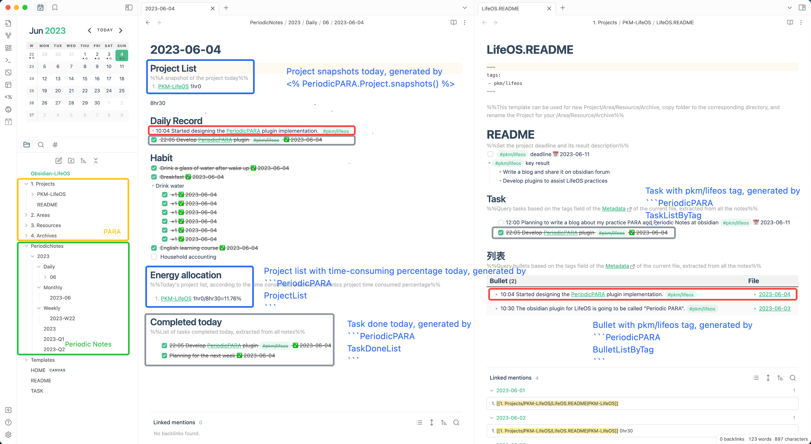
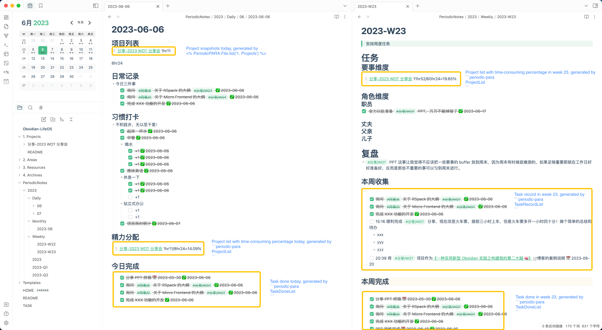
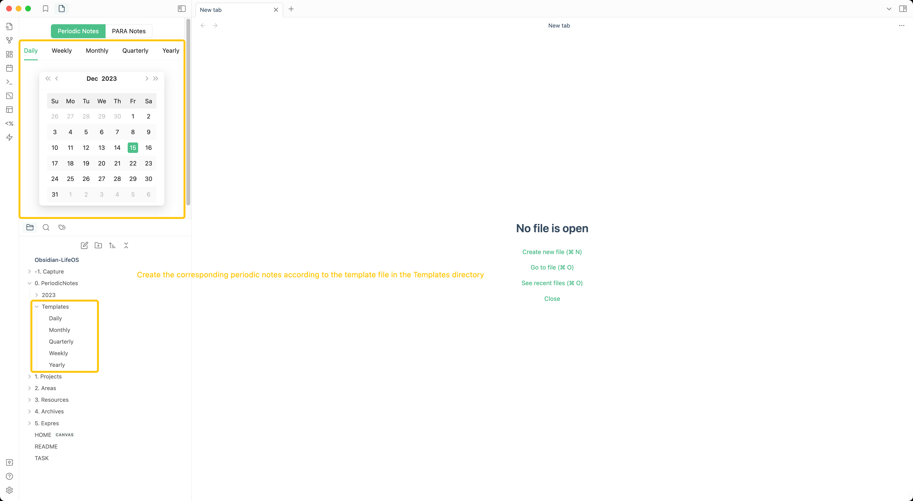
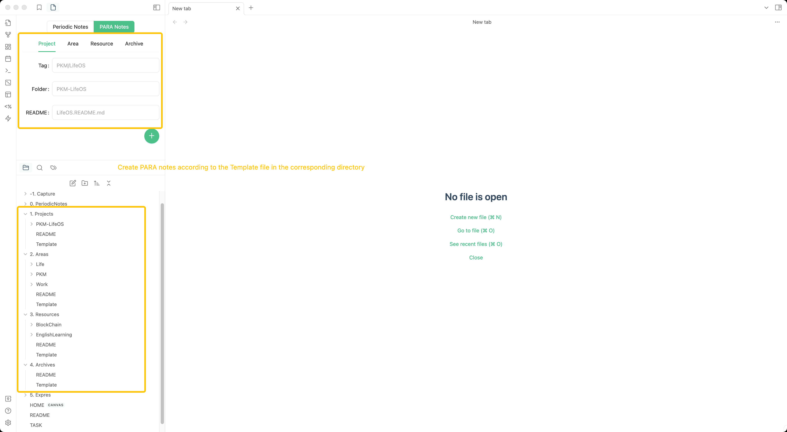

# Obsidian Periodic PARA

- This is a plugin for [LifeOS](https://forum.obsidian.md/t/building-my-second-brain-with-obsidian/62934), which assist in practicing the PARA system with periodic notes.
- You can download the [LifeOS-example](https://github.com/quanru/obsidian-example-LifeOS/tree/english-version) to experience it.

## Screenshots

### Views





### Create Periodic Notes & PARA Notes

> See [Youtube Demo](https://www.youtube.com/watch?v=poey9QoB7ns)

It is recommended to work with [Templater](https://silentvoid13.github.io/Templater/) so that you can use the template variables and functions provided by [Templater](https://silentvoid13.github.io/Templater/).




### Daily Record 

https://github.com/quanru/obsidian-periodic-para/assets/11739753/3d967527-b021-4a15-acd4-f5e6b0701a99

## Installation

> [Dataview](https://github.com/blacksmithgu/obsidian-dataview) is required, please install it first.

#### Recommended

Periodic PARA is available in the Obsidian community plugin browser!

1. Search for "Periodic PARA" in Obsidian's community plugins browser
2. Enable the plugin in your Obsidian settings (find "Periodic PARA" under "Community plugins").
3. Check the settings. You can customize the directory of periodic notes and PARA notes.

#### Manual

Go to the [releases](https://github.com/quanru/obsidian-periodic-para/releases) and download the latest `main.js` and `manifest.json` files. Create a folder called `periodic-para` inside `.obsidian/plugins` and place both files in it.

## Settings

| Periodic Notes Settings | Description                                                                                                                                                                                                                    |
| ----------------------- | ------------------------------------------------------------------------------------------------------------------------------------------------------------------------------------------------------------------------------ |
| Enable                  | Whether to turn on Periodic Notes                                                                                                                                                                                              |
| Periodic Notes Folder   | Default is 'PeriodicNotes', Set a folder for periodic notes. The format of daily, weekly, monthly, quarterly, and yearly notes in the directory must meet the following requirements: YYYY-MM-DD、YYYY-Www、YYYY-MM、YYYY-Qq   |
| Project List Header     | Default is 'Project List', Set the title of the module in which the project snapshots are located in daily notes to collect the projects experienced in the current period in the weekly, monthly, quarterly, and yearly notes |
| Area List Header        | Default is 'First Things Dimension', Set the title of the module in which the area snapshots are located in quarterly notes to collect the areas experienced in the current period in the yearly notes                         |
| Habit List Header       | Default is 'Habit', Set the title of the module in daily notes where the habit is located, and the task query view will ignore tasks under that title                                                                          |

| Daily Record Settings | Description                                      |
| --------------------- | ------------------------------------------------ |
| Enable                | Sync daily record by remote API                  |
| Header                | Where the Daily Record module is in a daily note |
| API                   | The daily record API                             |
| Token                 | The token of your API                            |

| P.A.R.A Notes Settings | Description                                                                                                                                                                           |
| ---------------------- | ------------------------------------------------------------------------------------------------------------------------------------------------------------------------------------- |
| Enable                 | Whether to turn on PARA Notes                                                                                                                                                         |
| Projects Folder        | Default is '1. Projects', Set a folder where the PARA project is located, each subdirectory is a project, and each project must have a [XXX.]README.md file as the project index      |
| Areas Folder           | Default is '2. Areas', Set a folder where the PARA area is located, each subdirectory is a area, and each area must have a [XXX.]README.md file as the area index                     |
| Resources Folder       | Default is '3. Resources', Set a folder where the PARA resource is located, each subdirectory is a resource, and each resource must have a [XXX.]README.md file as the resource index |
| Archives Folder        | Default is '4. Archives', Set a folder where the PARA archive is located, each subdirectory is a archive, and each archive must have a [XXX.]README.md file as the archive index      |

## Usage

### daily record

You can quickly record through [Shortcuts](https://support.apple.com/guide/shortcuts-mac/intro-to-shortcuts-apdf22b0444c/mac) and pull them into your diary through this plugin.

Currently, only plain text can be recorded.

There are two ways to use it: 
1. Free self-deployment mode: Integration with [usememos](https://github.com/usememos/memos), you need to deploy your own usemes.
2. Subscription mode: [Contact](https://github.com/quanru/obsidian-periodic-para#support) the author to purchase or obtain a trial token.

[Shortcuts (iOS, iPadOS or macOS)](https://www.icloud.com/shortcuts/1eaef307112843ed9f91d256f5ee7ad9)

### query code block

Periodic PARA works by writing markdown code block, which query project, area, task list according to the date parsed from current filename, and query task, bullet, project, area, resource, archive list according to the tags parsed from frontmatter.

#### query by time

Time scope is parsed from current file name, for example:

- 2023-01-01.md // Only 1 January is included
- 2023-W21.md // Every day of week 21
- 2023-06.md // Every day and every week of June
- 2023-Q3.md // Every day, every week, every month of Quarter 3
- 2023.md // Every day, every week, every month, every quarter of 2023

````markdown
```PeriodicPARA
TaskDoneListByTime
```
````

````markdown
```PeriodicPARA
TaskRecordListByTime
```
````

````markdown
```PeriodicPARA
ProjectListByTime
```
````

````markdown
```PeriodicPARA
AreaListByTime
```
````

#### query by tag

Tags is parsed from the frontmatter of current file, for example:

```markdown
---
tags:
  - x-project
---
```

The following code block would use x-project as the tag for the query.

````markdown
```PeriodicPARA
TaskListByTag
```
````

````markdown
```PeriodicPARA
BulletListByTag
```
````

````markdown
```PeriodicPARA
ProjectListByTag
```
````

````markdown
```PeriodicPARA
AreaListByTag
```
````

````markdown
```PeriodicPARA
ResourceListByTag
```
````

````markdown
```PeriodicPARA
ArchiveListByTag
```
````

#### query para by folder

````markdown
```PeriodicPARA
ProjectListByFolder
```
````

````markdown
```PeriodicPARA
AreaListByFolder
```
````

````markdown
```PeriodicPARA
ResourceListByFolder
```
````

````markdown
```PeriodicPARA
ArchiveListByFolder
```
````

### [templater](https://github.com/SilentVoid13/Templater) helpers

#### Generate list

Generate a list of README.md snapshots in the specified directory.

```markdown
<% PeriodicPARA.Project.snapshot() %>
<% PeriodicPARA.Area.snapshot() %>
<% PeriodicPARA.Resource.snapshot() %>
<% PeriodicPARA.Archive.snapshot() %>
```

For example:

```markdown
<% PeriodicPARA.Project.snapshot() %>
```

to

```markdown
1. [[1. Projects/x-project/README|x-project]]
2. [[1. Projects/y-project/README|y-project]]
```

## Support

- [Twitter](https://twitter.com/quanruzhuoxiu)
- [Discord](https://discord.gg/HZGanKEkuZ)
- [Email](mailto:quanruzhuoxiu@gmail.com)

## Acknowledgements

Also, I relied on the code from these excellent plugins:

- [PARA](https://fortelabs.com/blog/para/). Thanks to Tiago Forte for inventing such a great organizational method.
- [obsidian-periodic-notes](https://github.com/liamcain/obsidian-periodic-notes). Gave me the inspiration to develop this plugin.
- [obsidian-dataview](https://github.com/blacksmithgu/obsidian-dataview). The underlying plugin uses dataview's query interface.
- [Templater](https://github.com/SilentVoid13/Templater). Provides decoupled template creation, allowing a very large number of plugins to create files with the help of it.

## Donations

If this plugin do help you, please buy me a cup of coffee on [buymeacoffee](https://www.buymeacoffee.com/leyang).

<a href="https://www.buymeacoffee.com/leyang">
  
</a>

---


---


