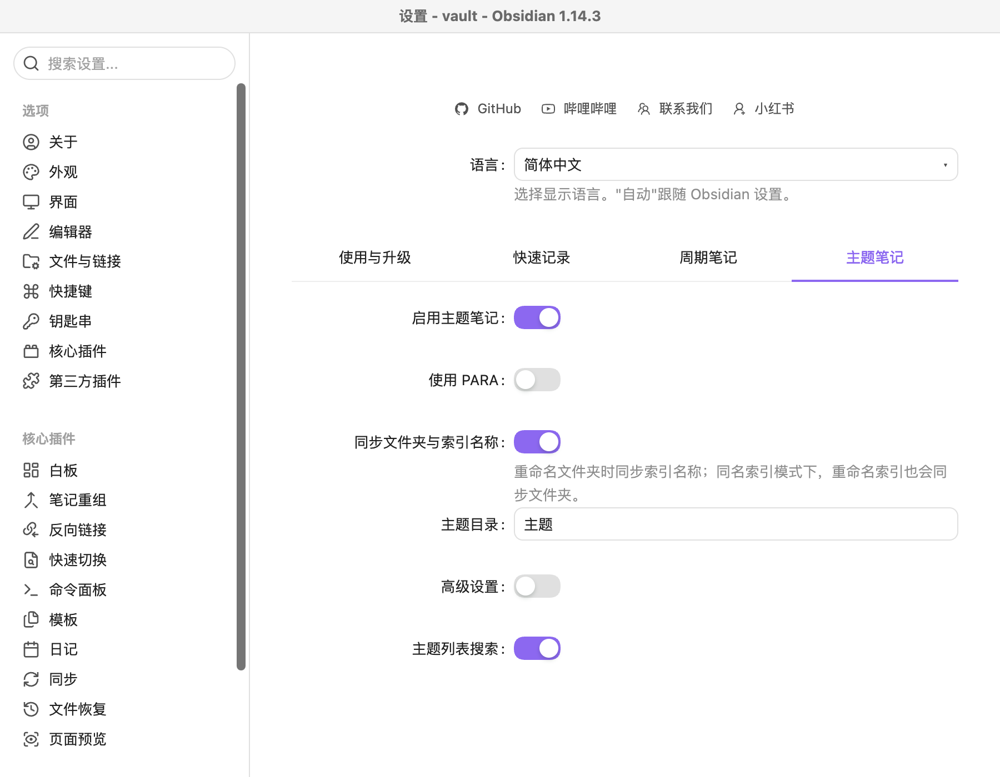
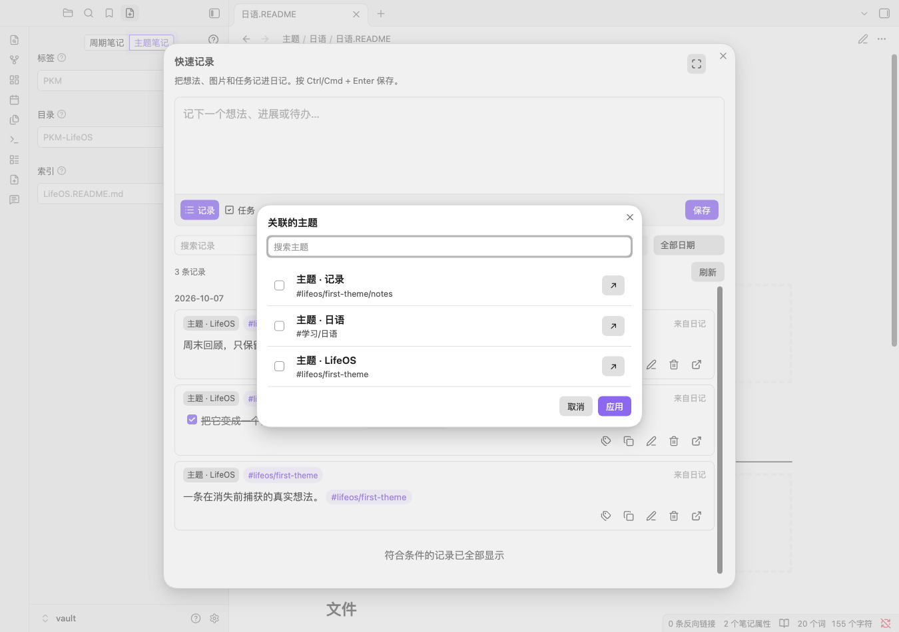
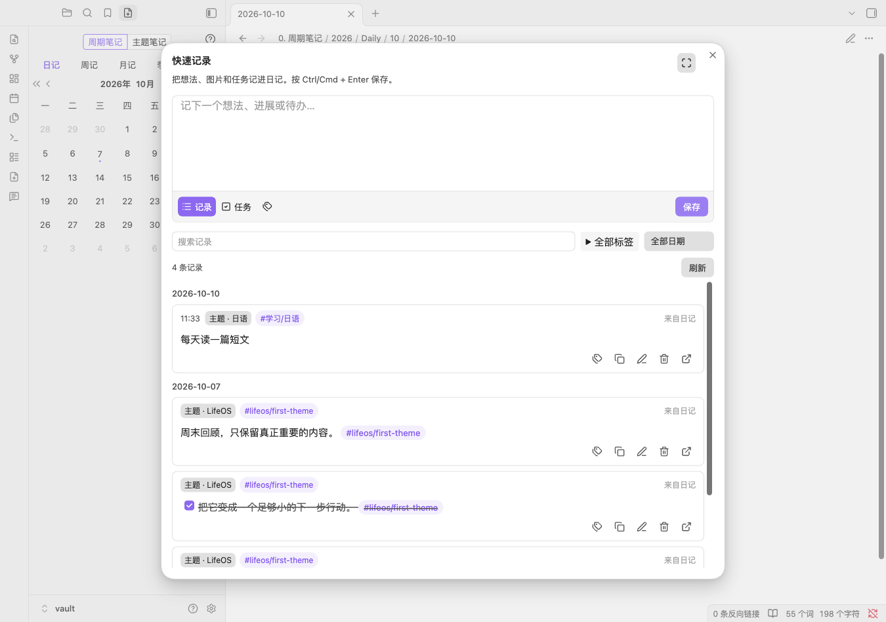
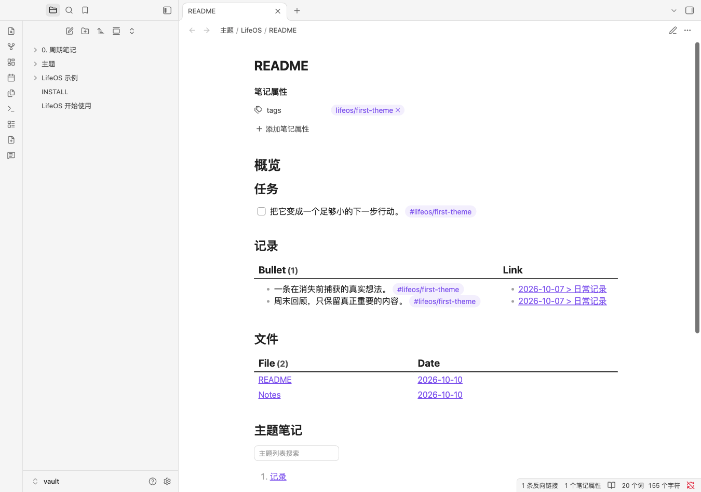

# 不绑定 PARA 的主题笔记

主题笔记把分散在日记和其他笔记中的记录、任务及资料集中到一个主题入口。普通主题模式无需创建项目、领域、资源和归档四类目录；原有 PARA 模式仍可使用。

## 开始使用

新库可以在初始化向导选择「主题笔记」。已有库进入插件设置 →「主题笔记」，启用主题笔记并关闭「使用 PARA」，再设置主题目录。切换模式不会搬动笔记或修改已有模板；普通主题和 PARA 的目录、索引命名、模板配置分别保留。



这里的「启用主题笔记」控制主题识别与创建，「使用 PARA」决定采用普通主题目录还是四类 PARA 目录。高级设置支持 README 风格、与文件夹同名的索引，以及自定义主题模板。未开启高级设置时使用 README 风格和主题目录中的 Template.md；默认模板缺失时，创建主题会使用内置基础模板。明确指定的自定义模板缺失时提示失败，不静默替换。

旧版中关闭了 PARA 的用户，升级后主题笔记也保持关闭；需要使用普通主题时再手动启用。

## 创建与关联

打开 LifeOS 创建笔记面板，切换到「主题笔记」，按顺序填写标签、目录和索引。例如：

```text
标签：#学习/日语
目录：日语
索引：日语.README.md
```

在「主题」目录下生成 `日语/日语.README.md`，并把标签写入笔记属性。README.md 与带前缀的 \*.README.md 均支持；同名模式使用 `日语/日语.md`。普通子笔记、模板文件和无标签索引不会进入快速记录的主题选择器。支持主题目录中的嵌套主题文件夹。

在快速记录输入框点击「关联主题」，搜索并选择主题，然后输入内容、保存到今日日记。默认主题设置也支持普通主题。选择主题会添加它的首个标签；记录包含该主题任一标签时，卡片就显示主题入口。已有记录无需重新保存或补齐全部标签。





标签仍是普通 Markdown 标签。例如 `tags: [学习/日语, 日语]` 的主题，`#学习/日语` 或 `#日语` 都能识别关联。多个主题共用标签可能同时显示关联；选择器会提示，不能把共用标签当作主题的唯一身份。移除关联时保留其他已选主题需要的共用标签，也保留无关标签、笔记链接和代码示例。

## 查看记录、任务与文件

内置主题模板提供以下查询块：

| 查询              | 内容                                   |
| ----------------- | -------------------------------------- |
| TaskListByTag     | 与主题标签关联的任务，勾选写回来源笔记 |
| BulletListByTag   | 与主题标签关联的记录，可打开来源       |
| FileListByTag     | 与主题标签关联的非周期资料笔记         |
| ThemeListByTag    | 与主题标签关联的其他主题索引           |
| ThemeListByFolder | 配置主题目录中的主题列表               |

```LifeOS
ThemeListByFolder
```

实际使用时，将上述代码块放入笔记并切换到阅读模式。主题列表支持搜索，查询会随索引变化刷新。主题自身和模板不会混入记录、任务结果；日记任务与记录采用快速记录的同一套标题边界规则，排除习惯统计及其他子标题中的条目。



快速记录、主题创建和原生主题列表不依赖 Dataview。任务、记录和文件查询块仍需要安装、启用 Dataview；本次没有替换开源版既有查询依赖。

## 日记快照与重命名

普通主题版的日记模板在主题标题下使用 `{{snapshot:Theme}}`。通过 LifeOS 创建日记时，它会替换成当时的主题索引链接列表；此后新增主题不会追溯改写旧日记。现有日记不会被覆盖。使用 Templater 的用户也可以继续调用 `<% LifeOS.Theme.snapshot() %>`；原有 `LifeOS.Project.snapshot()` 等 PARA 快照入口保留。

启用名称同步后：

- 重命名文件夹会同步与原文件夹同名的索引，包括 `原名称.md` 或 `原名称.README.md`；普通 README.md 保持原名。
- 同名索引模式下，重命名索引也会同步主题文件夹。
- 目标重名时提示冲突，不覆盖其他文件。用户已执行的第一次重命名保留，需要自行解决冲突；插件不会回滚用户操作。

## 配套示例库

[开源示例仓库](https://github.com/quanru/obsidian-example-lifeos) 的每种语言都提供四类工作库：原有 LifeOS Vault、LifeOS Blank Vault，以及新增 LifeOS Theme Vault、LifeOS Theme Blank Vault。

普通主题示例包含主题索引、关联资料、日记记录和任务，并放入同标签习惯任务用于验证过滤。空白版只保留指南、模板和配置。示例包不包含插件二进制，需单独安装更新后的开源版 LifeOS 和 Dataview。配套发行版为示例库 1.20.0，需搭配 LifeOS 1.29.0 或更新版本。

[English guide](theme-notes.en.md)
